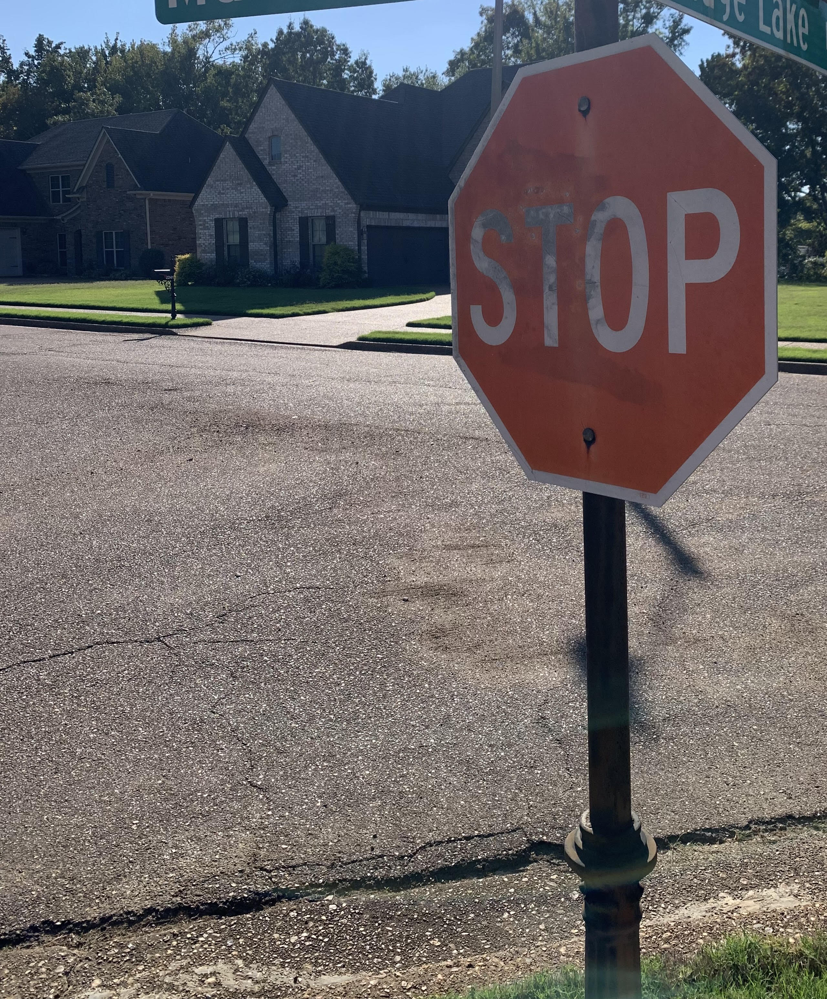
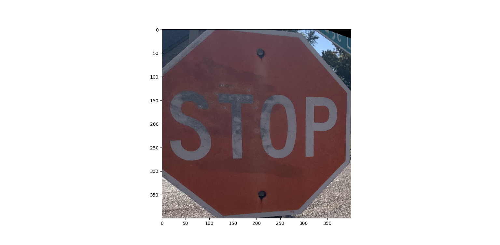
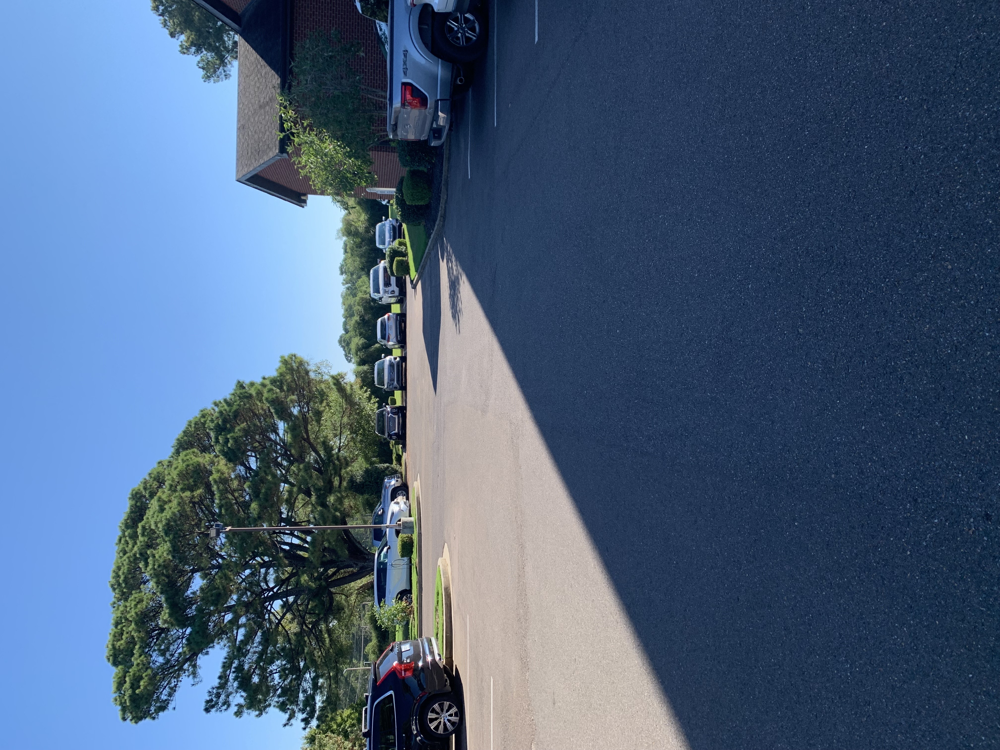
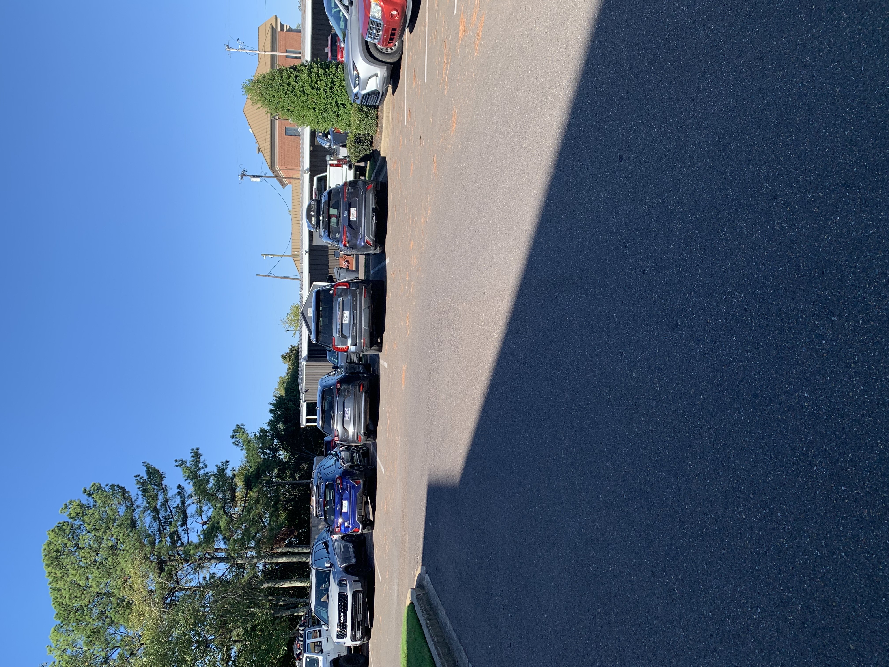
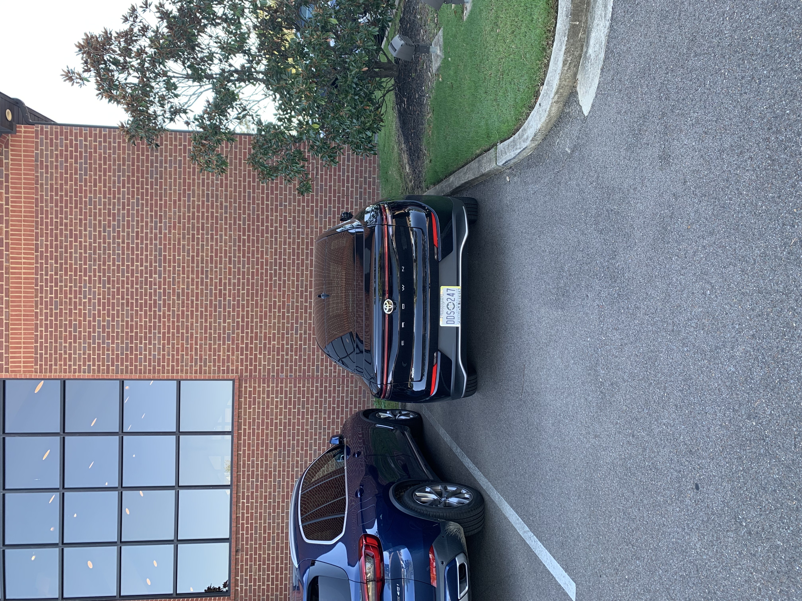
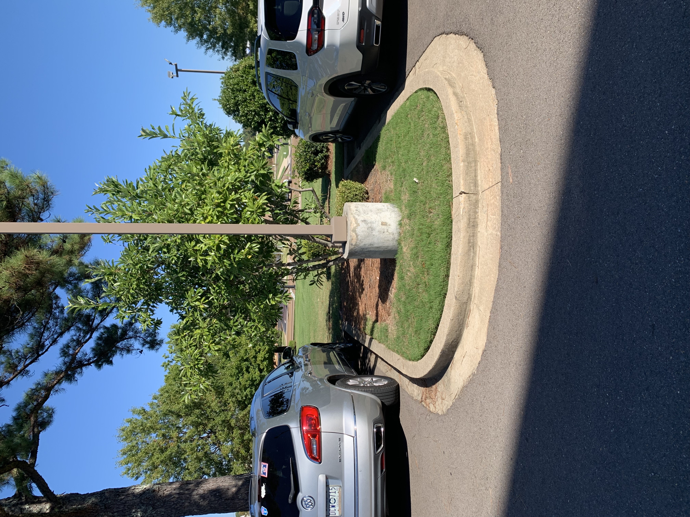
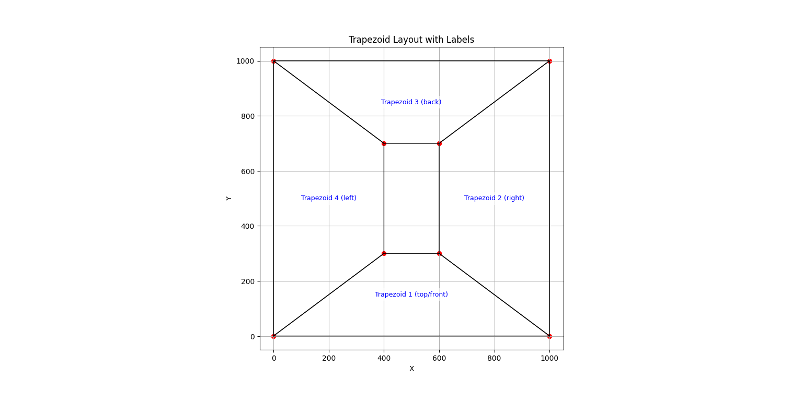
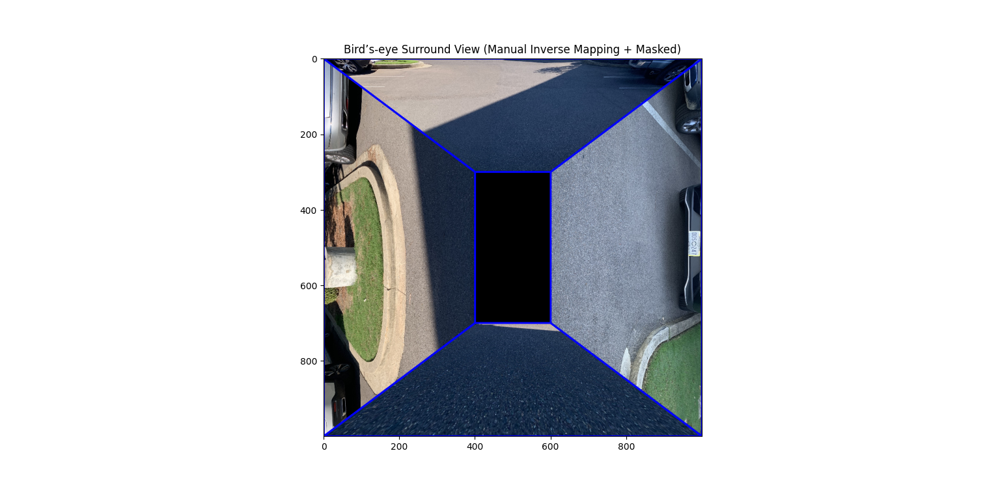

# Project 2 Report

---

## Part 1: Image Homography Estimation

In this first part, the goal was to understand/apply a 2D projective transformation to map a planar surface into a rectified front view. 
The project starts by manually selecting corresponding points between the input and a target rectangular region. 
These point correspondences were used to estimate the homography matrix using the Direct Linear Transform (DLT) algorithm.

The DLT builds a linear system of Ah=0, where each pair of corresponding points contributes two equations.
SVD is then used to find the least-squares solution, and then the result is reshaped back into a 3x3 matrix,
and normalized so that H_33 = 1.

The resulting homography is now a mapping between the two planes:the image plane and the rectified target plane. 
Since the instructions specifically said to use inverse mapping, that was used in this project.
InvMapping allows for every pixel in the destination image, and nearest neighbor interpolation was used for decimal values.

Here's the result: 

  

Above is the input image captured at an angle. Below is the rectified result after applying the computed homography:

  

This shows how homography estimation can recover a front-view perspective of a planar surface. 
The result confirms that the original angled-surface is corrected into a relatively less undistorted view.

---

## Part 2: Creative Application (Exploration and Extension)

For Part 2, the project extended homography into a multi-view application. I chose simulating a car’s 360 top-down camera system. 
This part requires merging four directional images (front, back, left, right) into a unified composite that represents a bird’s-eye surround view.

Each input image was captured from approximately the same location but facing different directions. 
The objective was to warp each view into a trapezoidal region in a 1000x1000 pixel canvas, 
forming a layout around a central black rectangle (representing the car).

Steps:

1. **Defining the destination layout:**

   * Four trapezoids were defined (front, right, back, left) surrounding the center rectangle.
   * Each trapezoid’s coordinates were manually chosen to ensure geometric symmetry.

2. **Selecting corresponding source points:**

   * For each camera image, four corner points (forming a rough trapezoid region on the road) were manually selected.
   * The points corresponded to the visible portion of the road near the car.

3. **Computing per-view homographies:**

   * Each image’s source trapezoid was mapped to its corresponding destination trapezoid using the same DLT method from Part 1.
   * This yielded four homography matrices, one for each view.

4. **Compositing:**

   * Each warped image was merged into a single canvas.
   * Red outlines were drawn to mark trapezoid boundaries, and a black rectangle was added to represent the center car.

This process created a (somewhat?) realistic top-down representation where all four camera perspectives merge around the vehicle.

---

### Input Images

  
  

  
  

---

### Trapezoidal Layout

The following visualizes the final trapezoid arrangement used to define where each camera view is projected in the composite image:

  

Each trapezoid corresponds to one direction (front, right, back, left), forming a surrounding view around the central region that represents the car.

---

### Final Output

The final top-down composite view merges the four warped images into a single0 scene.
The blue boundary lines indicate transitions between each warped region, and the black rectangle marks the car’s position.

  

As one can see, the final result sort-of works, but doens't look that good. 
Most likely due to tilted angle that wasn't quite accounted for, but overall still works I suppose. 

---

### Notes and Observations

* Alignment accuracy would depend quite heavily on the precision of manually selected correspondences. Bad selection == low alignment
* Some discontinuties along edges occurred since each homography is applied independently. Might be improved by blending certain overlaps together.
* Adding something like bilinear interpolation might result in a smoother warping.
